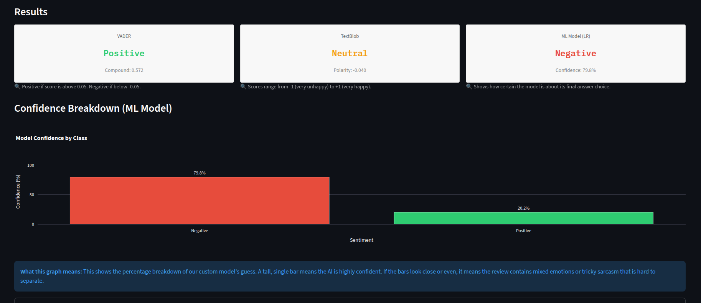
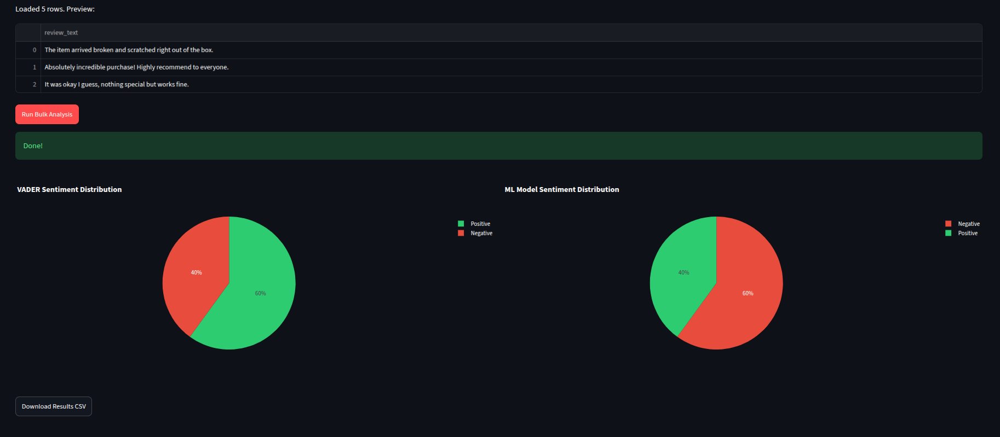

# 🔍 Amazon Review Sentiment Analysis

## 🎯 Project Overview
An end-to-end NLP pipeline evaluating three separate sentiment classification techniques on 50,000 sampled e-commerce records. This repository hosts a data preprocessing pipeline, evaluation notebooks, and an interactive presentation interface designed for non-technical stakeholders to contrast machine learning behavior against classic dictionary rule-sets.

## 🚀 Live Interactive App
Experience the live application deployment inside your browser instantly:
👉 **[Live Preview](https://amazon-reviews-sentiment-analyzer.streamlit.app)**

---

## 📸 Interface Screenshots

### 1. Single Review Deep-Dive Mode

*Figure 1: Side-by-side metric badges displaying contrasting AI classification models with plain-language descriptive captions.*

### 2. Bulk Business Analytics Module

*Figure 2: Automatic CSV upload parsing visual pie distributions and generating downloadable processed datasets.*

---

## 📊 Core Methods Evaluation Matrix
Our testing phase evaluated traditional lexicons against supervised classifiers to determine structural precision across challenging edge-cases (such as sarcasm, double negatives, and modern marketplace slang):

| Method | Accuracy | Setup Requirements | Architectural Profile | Primary Use-Case |
| :--- | :---: | :---: | :--- | :--- |
| **VADER** | **85.8%** | None (Rule-Based) | Optimized rule-book handling punctuation highlights, capitals, and emojis. | Short, casual marketplace reviews. |
| **TextBlob** | **80.2%** | None (Lexicon-Based) | Calculates descriptive adjective weights using static dictionary pools. | Standard, formal English text. |
| **Logistic Regression + TF-IDF** | **89.6%** | Supervised Training | Learns custom text context weights directly from historical customer trends. | Enterprise-grade, domain-focused accuracy. |

---

## 🛠️ Built With & Technology Stack
*   **Language & Engine:** Python 3.12
*   **Text Processing Frameworks:** Natural Language Toolkit (NLTK), TextBlob, Regular Expressions
*   **Supervised Machine Learning Engine:** Scikit-learn (TF-IDF Text Feature Engineering & Logistic Regression)
*   **Data Visualization Suites:** Plotly Express, Plotly Graph Objects
*   **Web Application Interface Deployment:** Streamlit Framework Architecture

---

## 🧠 Critical Analytical Findings

*   **The Custom AI Advantage:** Our supervised machine learning model outperforms general tools by up to 9.4% because it captures specific industry context instead of relying on general vocabulary collections.
*   **The Negative Blind Spot:** Due to a prominent positive class distribution in real marketplace reviews, the custom ML algorithm is highly sensitive to isolated heavy phrases. It gets easily tricked by double negatives like *"not bad at all"* because the single token *"bad"* overrides the structural context.
*   **Frustrated Buyers Write More:** Data extraction metrics show that unhappy customers write roughly 11% more text content on average than satisfied ones as they map out every point of failure.

---